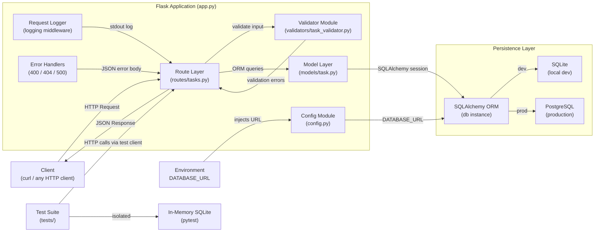
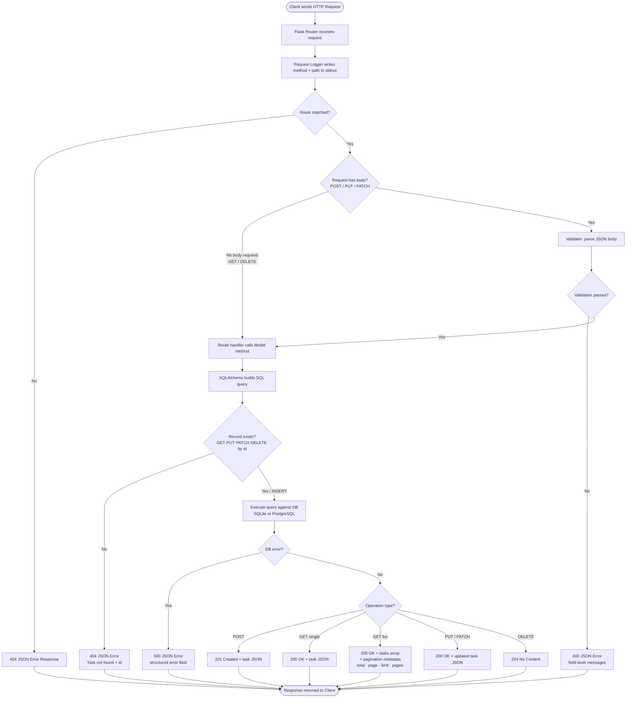

# Architecture — Task Management REST API

## Overview

A lightweight REST API built with Python and Flask that exposes full CRUD operations for task management, backed by SQLAlchemy ORM to support both SQLite (local development) and PostgreSQL (production) without code changes. The application is organised into discrete modules (models, routes, validators, config) for maintainability, starts with a single command, and auto-provisions the database schema on first run.

## Component Diagram

## Data Flow

## Components

| Component | Responsibility | Technology |
|---|---|---|
| `app.py` | Application entry point; creates Flask app, registers blueprints, initialises DB, starts server | Python 3.9+, Flask |
| `config.py` | Reads `DATABASE_URL` env var; provides `DevelopmentConfig` (SQLite) and `ProductionConfig` (PostgreSQL) | Python `os`, python-dotenv |
| `models/task.py` | Defines `Task` ORM model with all fields, default values, and `to_dict()` serialisation | SQLAlchemy, Flask-SQLAlchemy |
| `routes/tasks.py` | Implements all six endpoint handlers; maps HTTP verbs to model operations; applies pagination; formats JSON responses | Flask Blueprint |
| `validators/task_validator.py` | Stateless validation functions for creation and update payloads; enforces field rules (length, enum, date format, not-in-past) | Python `datetime`, standard lib |
| `middleware/logger.py` | Before/after request hooks that log method, path, and response status code to stdout | Python `logging` |
| `middleware/error_handlers.py` | Registers global handlers for 400, 404, and 500; ensures all errors return structured JSON with an `error` field | Flask error handlers |
| `extensions.py` | Instantiates shared `SQLAlchemy` db object to avoid circular imports | Flask-SQLAlchemy |
| `tests/` | Unit test suite covering all happy paths, validation failures, 404s, and complete endpoint | pytest, Flask test client |
| `requirements.txt` | Pinned dependency manifest for reproducible installs | pip |
| `README.md` | Prerequisites, installation, env vars, run instructions, test instructions, curl examples for every endpoint | Markdown |
| `Dockerfile` / `docker-compose.yml` | Optional containerised deployment with PostgreSQL service | Docker (optional) |

## Design Decisions

| ID | Decision | Rationale |
|---|---|---|
| DD-01 | Use Flask over FastAPI or Django | Flask is minimal, has no async complexity for this synchronous use case, starts with zero boilerplate, and satisfies `python app.py` launch requirement with ease |
| DD-02 | Use Flask-SQLAlchemy with `DATABASE_URL` env var | Single ORM abstraction covers SQLite locally and PostgreSQL in production; switching requires only an env var change, satisfying NFR-03 and FR-14 without any code modification |
| DD-03 | Modular file structure (`models/`, `routes/`, `validators/`, `middleware/`) instead of single file | Satisfies NFR-05; separates concerns so each module can be tested, replaced, or extended independently |
| DD-04 | Separate `extensions.py` for the db instance | Prevents circular imports between `app.py`, `models/`, and `routes/` — a known Flask-SQLAlchemy pattern |
| DD-05 | Hard delete for `DELETE /tasks/{id}` | Requirement Q&A defaulted to hard delete per acceptance criteria; schema and service layer are designed so a soft-delete `deleted_at` column can be added later without endpoint contract changes |
| DD-06 | Stateless validator functions returning error dicts rather than raising exceptions | Keeps validation logic pure and easily unit-testable in isolation without needing a Flask application context |
| DD-07 | In-memory SQLite (`sqlite:///:memory:`) for test suite | Satisfies NFR-07; tests are fully isolated, leave no files on disk, and run without environment setup |
| DD-08 | `completed_at` set server-side in `PATCH /tasks/{id}/complete` handler | Ensures timestamp accuracy is controlled by the server clock, not client-supplied data, preventing spoofed completion times |
| DD-09 | Pagination metadata (`total`, `page`, `limit`, `pages`) included in all `GET /tasks` responses | Satisfies FR-03; clients can implement UI paging without issuing a separate count query |
| DD-10 | Global 500 error handler returning structured JSON | Satisfies NFR-04; raw stack traces never reach the client, which is critical even without auth for reliability and future security readiness |

## Tech Stack

| Layer | Choice | Why |
|---|---|---|
| Language | Python 3.9+ | Requirement-mandated; broad OS compatibility (macOS, Linux, Windows) per NFR-08 |
| Web Framework | Flask 3.x | Lightweight, minimal setup, native `python app.py` launch, large ecosystem, no async overhead needed |
| ORM | Flask-SQLAlchemy 3.x | Declarative models, handles DB session lifecycle, abstracts SQLite/PostgreSQL behind `DATABASE_URL` |
| DB Driver — Dev | SQLite (stdlib `sqlite3`) | Zero-install local database; no server process required; ideal for development and tests |
| DB Driver — Prod | psycopg2-binary | Standard, well-maintained PostgreSQL adapter; binary wheel avoids native build dependencies |
| Validation | Custom module + Python stdlib (`datetime`, `re`) | No heavy dependency needed for the defined rules; keeps the validator pure Python and easily testable |
| Testing | pytest + Flask test client | Industry-standard; simple fixture model; `pytest` single-command execution satisfies NFR-07 |
| Env Config | python-dotenv | Loads `.env` file for local dev without polluting shell; zero-config in production where env vars are set natively |
| Logging | Python stdlib `logging` | No extra dependency; writes structured request logs to stdout per NFR-09 |
| Serialisation | Flask `jsonify` + model `to_dict()` | Built-in; avoids marshmallow overhead for this schema complexity level |
| Packaging | `requirements.txt` with pinned versions | Satisfies NFR-06; reproducible installs across all environments |
| Containerisation | Docker + docker-compose (optional) | FR-18 marks this optional; provided for teams preferring containerised workflows |